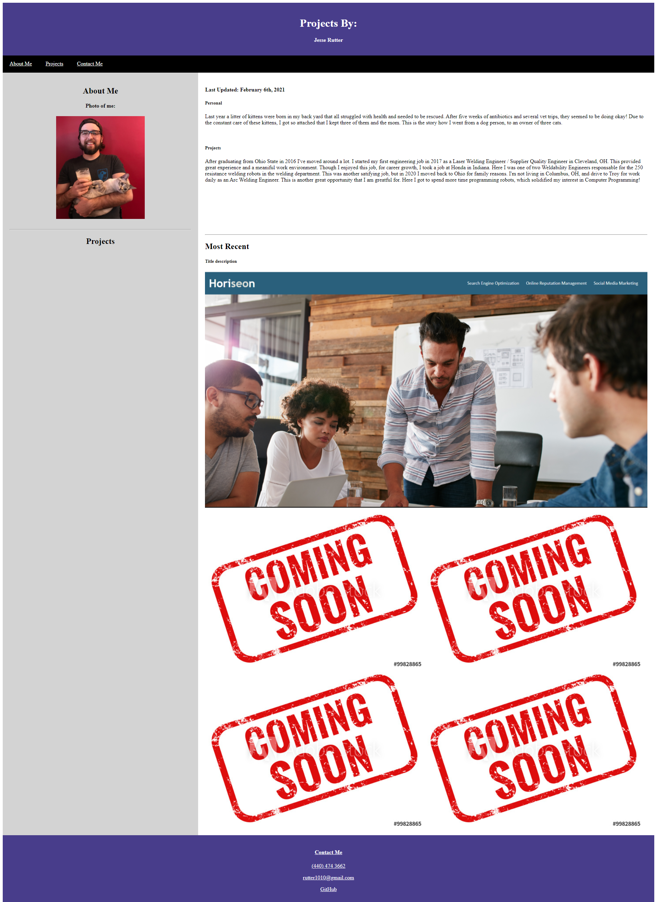

# osu-hw-2
For this assignment I created a portfolio using a template I found online, and edited to work for my content. I do not have many projects for my portfolio, so I left filler images to fill out later. HTML and CSS were used to create the website, and each section of the code are thoughtfully commented. The one project that is linked in this homework is the project from homework 1.

If you would like to see the finished product please visit https://rutter10.github.io/osu-hw-2/

